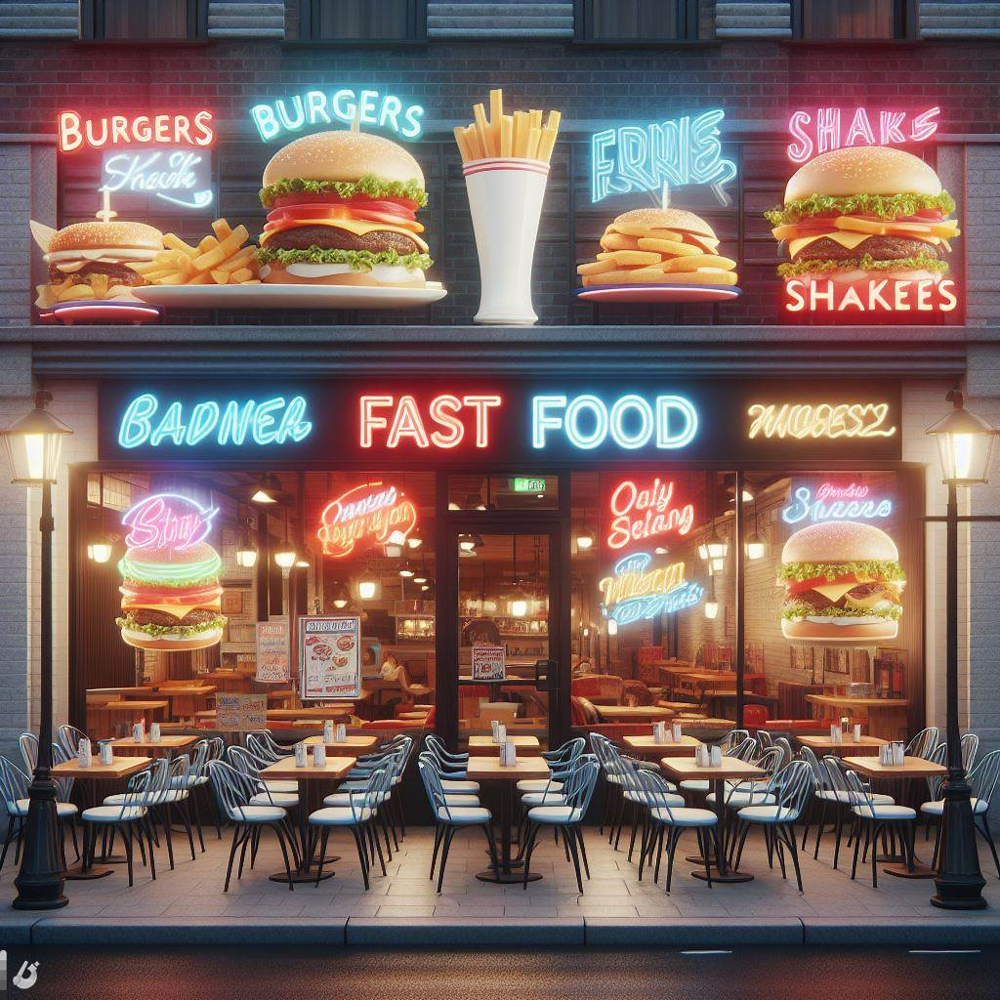

# FoodieExpress

Welcome to FoodieExpress, a Streamlit-based web application mimicking a food delivery system. Explore different features, analyze data, and place orders seamlessly!


## Tables
- **[delivery_partner]:**
- **[food]:**
- **[menu]:**
- **[order_details]:**
- **[order]:**
- **[restaurants]:**
- **[users]:**

## Getting Started
1. **Installation:**
   ```bash
   pip install -r requirements.txt

2. **Run the App:**
    ```bash
    streamlit run app.py

## Special Thanks

I would like to express my sincere gratitude to [Nitish Singh] for their invaluable guidance and support throughout this project.

- [Nitish Singh]
  - GitHub: [@campusx-official] (https://github.com/campusx-official)